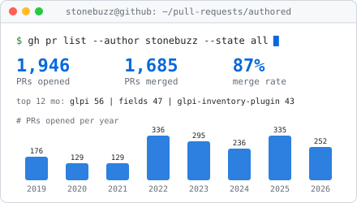
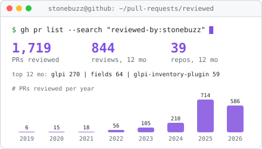

<p align="center">
  
</p>

```yaml
# $ cat ~/about.yml
name: Stanislas Kita
role: Software developer, GLPI core and plugins
company: Teclib' (publisher of GLPI)
location: Paris, France
on_github_since: 2014
focus: [inventory, plugin maintenance, security hardening, code review]
stack: [PHP, Twig, JavaScript, Java, MySQL, Docker, GitHub Actions]
```

I have been working on [GLPI](https://github.com/glpi-project/glpi), the free and open source ITSM and asset management software, for about ten years.
I contributed heavily to the native inventory that shipped with GLPI 10, and I maintain a large part of the [pluginsGLPI](https://github.com/pluginsGLPI) ecosystem.
These days I spend most of my time reviewing: since 2025 I review two to three times more pull requests than I open.

### What I work on

- **Inventory**: native inventory in the GLPI core (network ports, SNMP credentials, locks, import rules) and the [GLPI Inventory plugin](https://github.com/glpi-project/glpi-inventory-plugin).
- **Plugin maintenance**: fields, escalade, datainjection, order, tag, genericobject and more, with parallel releases for GLPI 10 and GLPI 11.
- **Security hardening**: rights checks, output escaping and entity isolation across plugins.
- **Identity and access**: SSO, OAuth2 and SCIM integrations for GLPI Network subscription plugins.
- **Mobile agents**: the [Android inventory agent](https://github.com/glpi-project/android-inventory-agent) and its inventory library.
- **CI**: shared GitHub workflows used to test and release GLPI plugins.

### Pull requests

<p align="center">
  <picture>
    <source media="(prefers-color-scheme: dark)" srcset="profile/author-dark.svg">
    
  </picture>
  <picture>
    <source media="(prefers-color-scheme: dark)" srcset="profile/reviewer-dark.svg">
    
  </picture>
</p>

<sub>Public repositories only, refreshed daily by a GitHub Action.</sub>

### Selected projects

| Project | What | My PRs |
| --- | --- | --- |
| [glpi-project/glpi](https://github.com/glpi-project/glpi) | GLPI core, ITSM and asset management | 650+ |
| [glpi-project/glpi-inventory-plugin](https://github.com/glpi-project/glpi-inventory-plugin) | Network discovery, inventory and deployment tasks | 150+ |
| [glpi-project/android-inventory-agent](https://github.com/glpi-project/android-inventory-agent) | Android inventory agent | 130+ |
| [pluginsGLPI/fields](https://github.com/pluginsGLPI/fields) | Additional fields for GLPI objects | 130+ |
| [pluginsGLPI/datainjection](https://github.com/pluginsGLPI/datainjection) | CSV import into GLPI | 65+ |
| [pluginsGLPI/escalade](https://github.com/pluginsGLPI/escalade) | Ticket escalation between groups | 65+ |

### Tech stack


<picture>
  <source media="(prefers-color-scheme: dark)" srcset="profile/snake-dark.svg">
  
</picture>
